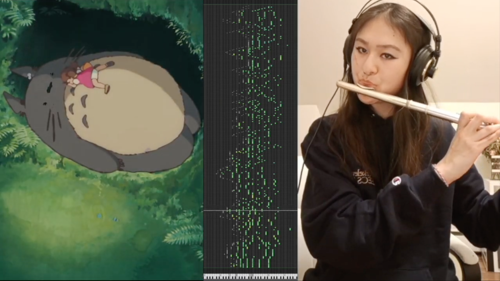

# lofi ghibli - music to train models/relax to 

10-615 ArtML Project 3

Kevin Chen, Maya Shen, Kayo Yin, Kenneth Zheng

## Final Composition

## Tools

- Ghibli-inspired melody generated using Super Piano 3, in `notebooks/Super_Piano_3.ipynb`
- Accompaniment generated using Music Transformer, in `notebooks/Generating_Piano_Music_with_Transformer.ipynb`
- Background texture generated using SampleRNN, in `samplernn`